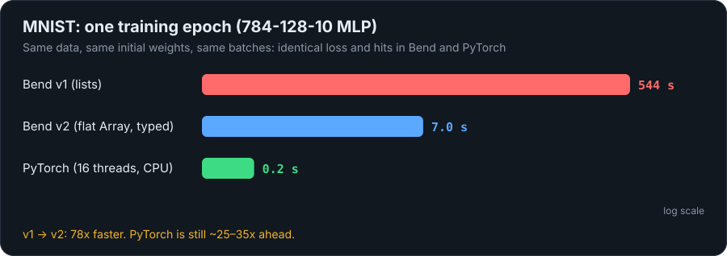
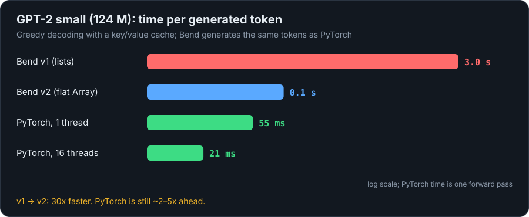
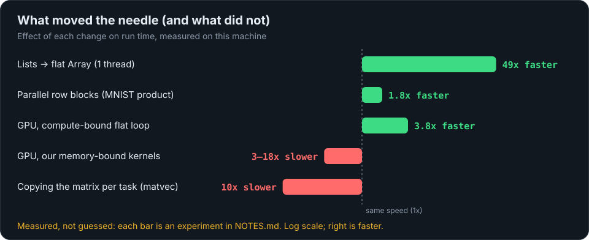
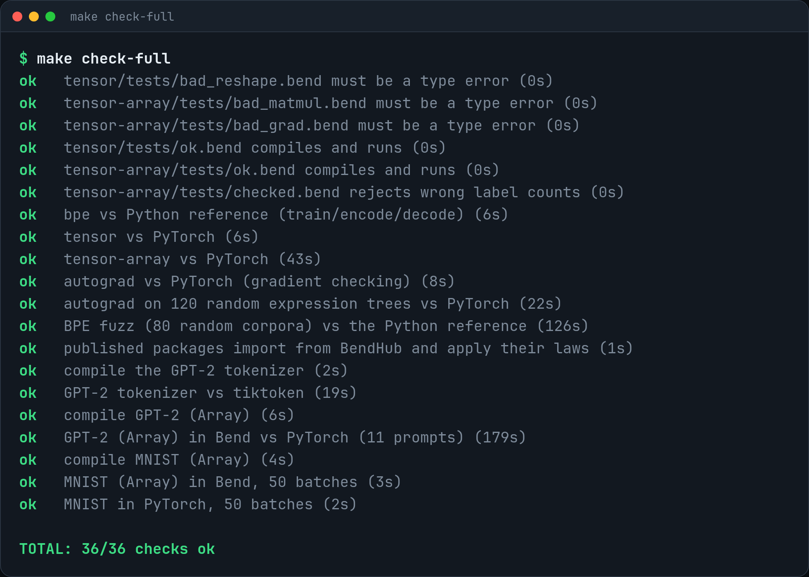

<p align="center">
  
</p>

<p align="center">
  <a href="https://github.com/nuxyel/bend-ml/actions/workflows/ci.yml"></a>
  <a href="LICENSE"></a>
  
  
  
  
</p>

<p align="center">
  <a href="https://github.com/nuxyel/bend-ml/releases/download/v2.1.0/bend-ml.mp4">
    
  </a>
  <br><sub>Click to watch the 60 s video.</sub>
</p>

**bend-ml** is a small machine-learning stack for [Bend 2](https://bend-lang.com), a language with dependent types. Tensor shapes live in the types, so multiplying a `2×3` by a `4×5` matrix is a **compile error**, and the important structural properties (a tokenizer that never loses a byte, a reverse mode that agrees with the forward mode) are **theorems checked by Bend's kernel**. On top of five published [BendHub](https://bend-lang.com) packages there are two demos: an **MNIST** classifier and **GPT-2 small (124 M)**, both checked against PyTorch.

<p align="center">
  
</p>

<details>
<summary>The source of that example (text, to copy)</summary>

```python
# (2x3) · (4x5): does not compile
def bad() -> TA.MMul<2n, 3n, 5n>:
  TA.Mat.matmul(2n, 3n, 5n, 0n, TA.Mat.zeros(2n, 3n), TA.Mat.zeros(4n, 5n))
```
```
Error:
- expected : TA.Mat<3n, 5n>
- observed : TA.Mat<4n, 5n>
```
</details>

## Why this exists

Bend's ecosystem wishlist asks for an AI framework ("PyTorch / llama.bend / etc.", [Taelin's post](https://x.com/VictorTaelin/status/2104956654542639176)), and the language's thesis is *"evolved by AI, secured by math"*. bend-ml tries to answer with the one thing only a dependently typed language can offer: **a PyTorch where a shape error does not compile**, written with AI help and guaranteed by laws the kernel checks, not by trust. It is also an honest experiment: every speed claim below was measured, including where Bend loses.

## At a glance

| | |
|---|---|
| **Proved** | 24 laws in 5 packages, re-checked by the Lean-proved kernel (`--verdict`). No `@unsafe`, no `?TODO`. |
| **Matches PyTorch** | MNIST: identical loss and hits. GPT-2: the same tokens, logits within 2e-4. Tokenizer: identical to `tiktoken` on 79 texts. |
| **Runs** | MNIST epoch in about **7 s** (v1: 544 s). GPT-2 at about **0.1 s per token** (v1: 3 s). |
| **Verified on every push** | CI runs 36 checks on a free GitHub runner, GPT-2 included. |
| **Reproducible** | `make setup && make check` on a fresh clone. No sudo. |

<p align="center">
  
</p>

## Packages on BendHub

| Package | Version | What it is | Proved LAWS |
|---|---|---|---|
| [`bend-ml-nat-lemmas`](nat-lemmas) | 0.1.1.0 | `Nat` and `List` lemmas that Base does not have | `add_comm`, `add_assoc`, `mul_comm`, `mul_assoc`, `mul_dist`, `append_assoc`, `length_append`, `product_append`... (15) |
| [`bend-ml-bpe-tokenizer`](bpe) | 0.1.2.0 | Byte-level BPE tokenizer (GPT-2 style) | **roundtrip** `decode(encode(s)) = s`, `vocab_bound`, `dec_append`, **`train_wf`** (`train` always produces a well-formed table) and **`roundtrip_trained`** (roundtrip for any trained table, no hypothesis) |
| [`bend-ml-tensor`](tensor) | 0.1.2.0 | `Vec<n>` and `Mat<r,c>` with the shape in the type, over lists | `reshape_swap`, `reshape_flat`; `reshape` only compiles with a proof that the number of elements does not change |
| [`bend-ml-tensor-array`](tensor-array) | 0.1.3.0 | `Mat<r,c>` over a flat `Array<F32>`, the same shape guarantee, **~50x faster** | `cap_ok` (the array capacity is enough); the products `matmul`, `matmul_nt`, `matmul_tn` (the shape of `dW = Xᵀ·dY` is checked by the type), parallel blocks |
| [`bend-ml-autograd`](autograd) | 0.1.1.0 | Automatic differentiation and layers with typed backward | **`reverse_eq_forward`**: the reverse mode of autodiff gives the same result as the forward mode |

```python
import bend-ml-tensor-array@0.1.3.0/main.bend as TA
import bend-ml-bpe-tokenizer@0.1.2.0/main.bend as BPE
```

<p align="center">
  
</p>

A shape error is also caught where it matters most, in a training step: the gradient of a weight matrix has the shape `Xᵀ·dY`, and the type checker verifies it. A `reshape` only compiles with a proof that the number of elements is preserved:

<p align="center">
  
</p>

## Demos

| Demo | Result |
|---|---|
| [MNIST](demos/mnist) (784-128-10 MLP) | **about 7 s per epoch** (6.6 to 7.2 s on an idle machine; v1: 544 s). Loss and hits **identical** to PyTorch with the same weights and batches: 0.5204771 / 9129, then 0.27043572 / 9298, then 0.2156194 / 9418. PyTorch takes 0.2 s per epoch ([honest benchmark](demos/mnist/BENCHMARK.md)). |
| [GPT-2 small](demos/gpt2) (124 M) | **~0.1 s per token** (v1: 3 s). It generates the **same tokens** as PyTorch (11 prompts), logits within 2e-4. PyTorch does the forward pass in 21 ms (16 threads) or 55 ms (1 thread); loading the weights takes ~7 to 10 s in Bend, with ~1.5 GB of memory ([details](demos/gpt2/BENCHMARK.md)). Tokenizer identical to `tiktoken` on 79 texts (49 fixed, 30 random Unicode). |

```
$ ./gpt2_fast "The capital of France is" 8
  id 262  logit -100.24986 ...
text: The capital of France is the capital of the French Republic, and
```

## Benchmarks (where Bend wins and where it loses)

<p align="center">
  
  
  
</p>

v1 used linked lists for the matrices and measured ~1800x PyTorch on MNIST. v2 measured each hypothesis (`NOTES.md`, experiments 1 to 10): swapping lists for a flat `Array` gave **~49x on one thread**, products in parallel blocks gave ~1.8x more, and in GPT-2 I found that **parallelizing matrix · vector by copying the matrix costs 10x more than computing**, so it runs sequentially. Distance to PyTorch now: MNIST ~25 to 35x, GPT-2 ~2 to 5x per token.

<details>
<summary>Why PyTorch is still ahead</summary>

Bend 2.0.35 generates scalar code, with no BLAS or SIMD: on the same matrix product PyTorch does 62 G multiply-adds/s on 1 thread and Bend with `Array` ~2.3 G/s (~27x). Parallelism scales ~2 to 4x on this hybrid CPU (P+E cores). The GPU was tried (a user-local CUDA 12 makes `!` work on the RTX 4050, see `docs/gpu-setup.md`): it is 3.8x faster than the CPU on compute-bound flat loops, but 3x to 18x slower on our memory-bound matrix kernels, so the benchmarks use the CPU.
</details>

## What we learned (conclusions so far)

- **Types can carry the shapes of a whole training step.** The MNIST step is type-checked end to end, including the shape of every gradient, and a mismatch is rejected before anything runs.
- **Proofs cover structure; tests cover numbers.** 24 laws are proved (tokenizer roundtrip, `reverse_eq_forward`, reshape size, array capacity). `F32` is not a real number, so every numeric claim is tested against PyTorch, NumPy and `tiktoken` instead: random shapes, random expression trees for autograd, fuzzed BPE corpora, 11 GPT-2 prompts.
- **The trust base is small and written down.** The kernel, Base's `F32` primitives and the fact that `Array.new(d)` gives `2^d` slots. [`docs/AUDIT.md`](docs/AUDIT.md) lists it with a reviewer checklist, and `reference/list_laws.py` prints every law statement.
- **Performance is bounded by the compiler, not by the types.** The type-level guarantees cost nothing at run time (the dimensions are erased). What limits Bend today is scalar code generation: flat arrays gave ~49x, parallelism ~2 to 4x, and the rest of the gap to PyTorch is BLAS and SIMD.
- **Copying is the hidden cost.** Splitting a matrix for parallel work by copying it costs 10x more than the arithmetic for matrix · vector, so the right design is to split the array without copying.
- **The GPU helps only compute-bound work.** 3.8x faster on flat numeric loops with 16384 leaves, slower on our list and `Array` kernels, which are chains of dependent pointer loads.
- **Some of my early claims were wrong, and measuring fixed them:** the PyTorch time per token was 21 ms, not 150 ms; the GPU is not "slower everywhere"; and the "~10 GB" of GPT-2 memory was virtual size (the resident peak is ~1.5 GB).

<details>
<summary>What is proved and what is tested</summary>

- **Reviewing the claims:** [`docs/AUDIT.md`](docs/AUDIT.md) lists the trust base and a checklist; `reference/list_laws.py` prints every law statement.
- **Proved by the kernel** (`bend X.bend --verdict`): the laws above, in five packages. No `@unsafe`, no `?TODO`, in any of them.
- **By the type**: the shapes of `matmul`, of each layer gradient (`dW: Mat<i,o>`) and `reshape` with a proof. The whole MNIST training step is checked this way.
- **Tested, not proved**: all `F32` numerics (it is not a real number; it rounds). Gradient checking and comparison with PyTorch live in `reference/`. The GPT-2 tokenizer is checked against `tiktoken` on ASCII, accented text, symbols, emoji, CJK and random Unicode.
</details>

## Quick start

Requirements: Linux x86_64 (or WSL), clang >= 14, Python >= 3.12, `curl`, ~3 GB of disk and 8 GB of RAM for the GPT-2 check.

```bash
git clone https://github.com/nuxyel/bend-ml.git && cd bend-ml
make setup          # Bend 2.0.35 (SHA256-checked), Lean 4.34.0, Python venv, MNIST and GPT-2 data; no sudo
make check          # 31 checks, about 1.5 min
make check-full     # + GPT-2 and MNIST
```

`make setup-lite` skips the 550 MB GPT-2 download. If you cloned this repository before 2026-10-04, clone it again: the history was rewritten (same content, English messages, smaller commits).

<p align="center">
  
</p>

## Verify everything

```bash
export PATH="$HOME/.bend/bin:$PATH"
reference/.venv/bin/python reference/check_all.py          # 31 checks, ~1.5 min
reference/.venv/bin/python reference/check_all.py --full   # + GPT-2 and MNIST (36 checks, ~5 min)
```

Data and weights preparation: [`reference/`](reference) (`gpt2_prep.py`, `mnist_torch.py`) and the README of each demo. To regenerate the images and the video in this page: `make media`.

## Limits

- **Performance:** see the benchmarks above; PyTorch is faster.
- **Memory:** the GPT-2 weights become trees of nodes. Loading streams 1 MB blocks straight into the arrays: peak resident memory is ~1.5 GB (the process reserves ~10 GB of address space), loading takes ~7 to 10 s.
- Only `Nat`, `U32` and `F32`; no `F64`.
- `Mat<r,c>` does not carry the invariant "the `Array` has capacity ≥ r*c" in its type: the constructors establish it with a **proved** capacity (`cap_ok`), but that `Array.new(d)` allocates `2^d` slots is a runtime fact that stays trusted.
- The GPT-2 pre-tokenizer classifies code points with a table generated from Unicode (`\s`, `\p{L}`, `\p{N}`) up to U+1FFFF; code points above that, and invalid UTF-8 bytes, count as letters.

## Structure

```
nat-lemmas/  bpe/  tensor/  tensor-array/  autograd/   # packages (main.bend + README + LICENSE)
demos/mnist  demos/gpt2                 # demos with README and BENCHMARK
reference/                              # PyTorch, tiktoken and check_all.py
poc/  bench/                            # proofs of concept (v0.2) and v2 micro-benchmarks
docs/                                   # audit guide, shape-error messages, launch material, media
NOTES.md                                # decisions, findings and debts
```

## License

[MIT](LICENSE).
