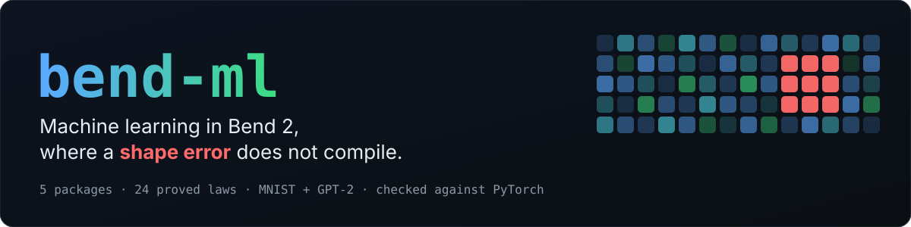
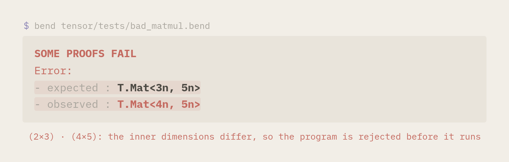
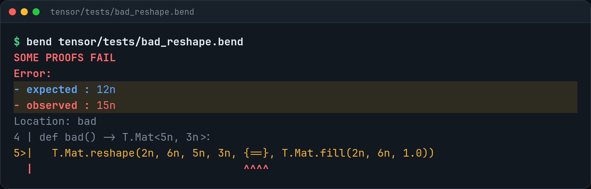
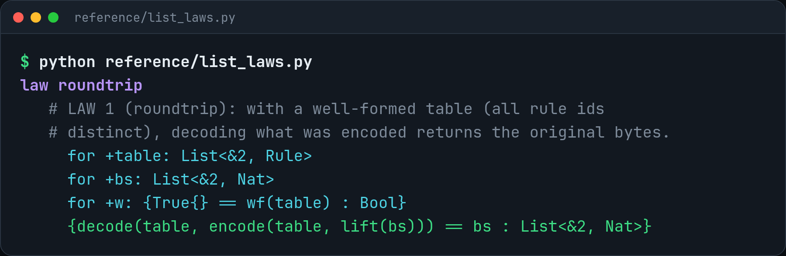
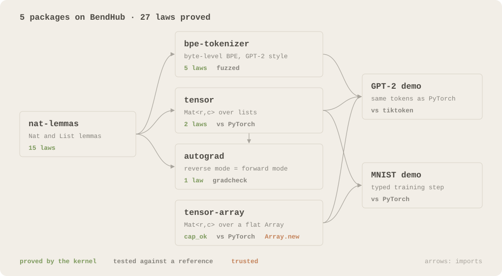
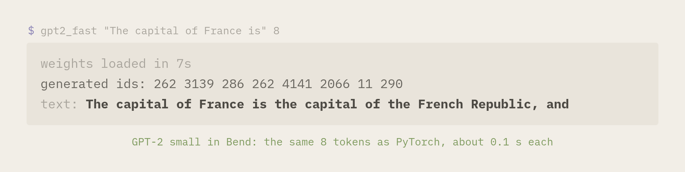
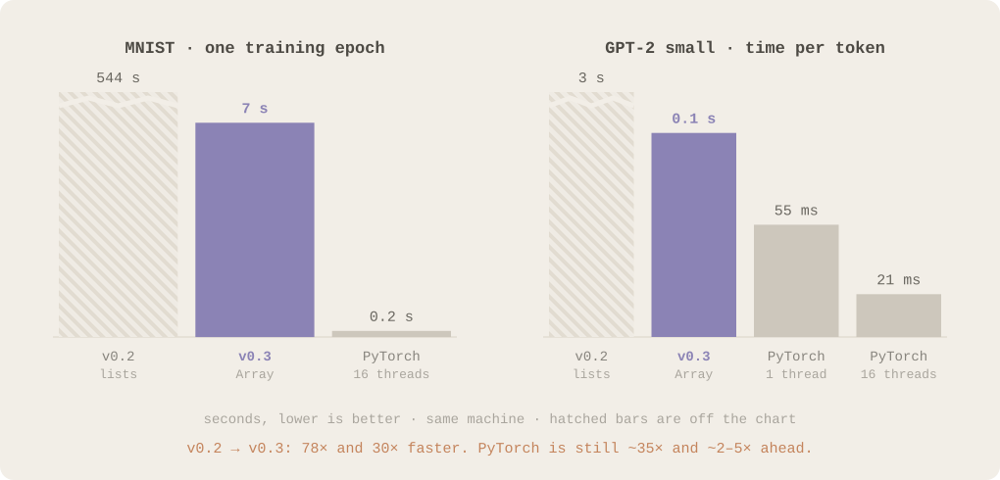
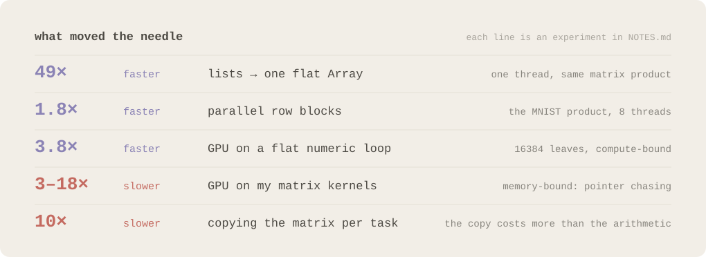

<p align="center">
  
</p>

<p align="center">
  <a href="https://github.com/nuxyel/bend-ml/actions/workflows/ci.yml"></a>
  <a href="LICENSE"></a>
  <a href="https://bend-lang.com"></a>
  
</p>

<p align="center">
  <a href="https://github.com/nuxyel/bend-ml/releases/download/v2.1.0/bend-ml.mp4"></a>
  <br><sub>the 60 s video: <a href="https://github.com/nuxyel/bend-ml/releases/download/v2.1.0/bend-ml.mp4">bend-ml.mp4</a></sub>
</p>

**bend-ml** is machine learning for [Bend 2](https://bend-lang.com). The shape of every tensor lives in its type, so a product of mismatched matrices does not compile, and the structural guarantees (a tokenizer that never loses a byte, a reverse mode that agrees with the forward mode) are laws that Bend's kernel checks. Five packages are on BendHub, and two demos run on them, an MNIST classifier and GPT-2 small, both checked against PyTorch.

## 01 · A shape error is a type error

<p align="center"></p>

```python
# (2x3) · (4x5): does not compile
def bad() -> TA.MMul<2n, 3n, 5n>:
  TA.Mat.matmul(2n, 3n, 5n, 0n, TA.Mat.zeros(2n, 3n), TA.Mat.zeros(4n, 5n))
```

The sizes do not have to be constants: in [`examples/runtime_batch.bend`](examples) the batch size comes from the input file, is checked once where the data enters, and every layer after that is checked for any batch size. The same holds for every layer of a training step: the gradient of a weight matrix must have the shape of `Xᵀ·dY`, and a `reshape` only compiles with a proof that the number of elements does not change.

<details>
<summary>the reshape case</summary>
<p align="center"></p>
</details>

<details>
<summary>how is this different from const generics (Rust's dfdx)?</summary>

[dfdx](https://github.com/coreylowman/dfdx) checks shapes with const generics: `Tensor<Rank2<3, 10>>` · `Tensor<Rank2<10, 5>>` is checked when it compiles. A size known only at run time is a `usize`, and from then on dfdx checks it when the program runs: a product asserts `assert_eq!(self.shape.1, rhs.shape.0)` ([matmul](https://github.com/coreylowman/dfdx/blob/4722a99d303f347d6088d95867d007c75ca6dd78/dfdx-core/src/tensor_ops/matmul/mod.rs#L191-L192)), and a reshape to a run-time shape asserts the number of elements ([reshape_like](https://github.com/coreylowman/dfdx/blob/4722a99d303f347d6088d95867d007c75ca6dd78/dfdx-core/src/tensor_ops/reshape_to/mod.rs#L91)). Only fully constant reshapes are checked at compile time ([`AssertSameNumel`](https://github.com/coreylowman/dfdx/blob/4722a99d303f347d6088d95867d007c75ca6dd78/dfdx-core/src/shapes/same_numel.rs#L13)).

In Bend a run-time size is still a variable in the type, and the checker reasons about it:

- [`examples/symbolic_reshape.bend`](examples/symbolic_reshape.bend) reads `n` from the command line and reshapes `Mat<n, 6>` into `Mat<n·2, 3>`. It compiles once, for every `n`, with a proof that `n·(2·3) = (n·2)·3` (`mul_assoc` from `bend-ml-nat-lemmas`). Asking for `Mat<n, 5>` instead ([`symbolic_reshape_bad.bend`](examples/symbolic_reshape_bad.bend)) does not compile: no proof of `n·6 = n·5` exists.
- [`examples/runtime_batch.bend`](examples/runtime_batch.bend) takes the batch size from its input file; every layer after the one check at the boundary is typed for any batch size.
- [`examples/square_transpose_bad.bend`](examples/square_transpose_bad.bend) is the bug that fits by accident: a 768 × 768 weight used as `X·W` instead of `X·Wᵀ`. With the sizes written as constants it compiles, in Bend as in any shape checker. Written once for any `d_in` and `d_out`, the two sizes have different names and it does not compile, even though it is only ever called with 768 and 768.
- The structural guarantees are laws checked by the kernel (section 02), not tests.

dfdx's last release is v0.13.0 (July 2023).
</details>

## 02 · Laws, not trust

| Package | Version | What it is | Proved LAWS |
|---|---|---|---|
| [`bend-ml-nat-lemmas`](nat-lemmas) | 0.1.1.0 | `Nat` and `List` lemmas that Base does not have | `add_comm`, `add_assoc`, `mul_comm`, `mul_assoc`, `mul_dist`, `append_assoc`, `length_append`, `product_append`... (15) |
| [`bend-ml-bpe-tokenizer`](bpe) | 0.1.2.0 | Byte-level BPE tokenizer (GPT-2 style) | **roundtrip** `decode(encode(s)) = s`, `vocab_bound`, `dec_append`, `train_wf`, `roundtrip_trained` |
| [`bend-ml-tensor`](tensor) | 0.1.2.0 | `Vec<n>` and `Mat<r,c>` with the shape in the type, over lists | `reshape_swap`, `reshape_flat` |
| [`bend-ml-tensor-array`](tensor-array) | 0.1.4.0 | the same guarantees over a flat `Array<F32>`, ~50x faster; `Bands<r,c>` for a parallel matrix · vector that copies no weights | `cap_ok`, `half_cover`; typed `matmul`, `matmul_nt`, `matmul_tn`, `Bands.matvec` |
| [`bend-ml-autograd`](autograd) | 0.1.1.0 | Automatic differentiation and layers with typed backward | **`reverse_eq_forward`** |

```python
import bend-ml-tensor-array@0.1.4.0/main.bend as TA
import bend-ml-bpe-tokenizer@0.1.2.0/main.bend as BPE
```

<p align="center"></p>

<p align="center"></p>

Every package passes `bend X/main.bend --verdict`, the re-check by Bend's Lean-proved kernel, with no `@unsafe` and no `?TODO`. Numbers are a different matter: `F32` is not a real number, so the numerics are tested against PyTorch, NumPy and `tiktoken` instead of proved. [`docs/AUDIT.md`](docs/AUDIT.md) lists the trust base.

## 03 · It runs

<p align="center"></p>

| Demo | Result |
|---|---|
| [MNIST](demos/mnist), 784-128-10 MLP | about 7 s per epoch (v1: 544 s). Loss and hits identical to PyTorch with the same weights and batches: 0.5204771 / 9129, then 0.27043572 / 9298, then 0.2156194 / 9418. |
| [GPT-2 small](demos/gpt2), 124 M | about 0.1 s per token sequential (v1: 3 s), 0.05 to 0.11 s with the weights in parallel bands (v3, 16 threads, depending on machine load). The same tokens as PyTorch on 11 prompts, logits within 6e-4 (they are of order 100); the tokenizer matches `tiktoken` on 79 texts. Loading takes ~7 s and ~1.5 GB. |

## 04 · Benchmarks

<p align="center"></p>

<p align="center"></p>

<details>
<summary>why PyTorch is still ahead</summary>

Bend 2.0.35 generates scalar code, with no BLAS or SIMD: on the same matrix product PyTorch does 62 G multiply-adds/s on one thread and Bend with an `Array` ~2.3 G/s. Parallelism adds ~2 to 4x on this hybrid CPU. The GPU (a user-local CUDA 12 makes `!` run on the RTX 4050, see `docs/gpu-setup.md`) is 3.8x faster on compute-bound flat loops but 3 to 18x slower on our memory-bound kernels, so the benchmarks use the CPU. v3 keeps a weight matrix as a tree of row bands (`Bands`), so each task of a matrix · vector product takes its band without copying it: the 50257 × 768 logits product goes from 25 ms to 6 ms on 16 threads, with the same numbers bit for bit. Full tables: [MNIST](demos/mnist/BENCHMARK.md), [GPT-2](demos/gpt2/BENCHMARK.md), and `NOTES.md`, experiments 1 to 11.
</details>

## 05 · What we learned

- Types can carry the shapes of a whole training step, and they cost nothing at run time: the dimensions are erased.
- Proofs cover the structure, tests cover the numbers. Of the 25 laws, the ones that matter most are the tokenizer roundtrip, `reverse_eq_forward`, the reshape size and the array capacity.
- The trust base is small and written down: the kernel, Base's `F32` primitives, and the fact that `Array.new(d)` gives `2^d` slots.
- Speed is bounded by the compiler, not by the types. Flat arrays gave ~49x, parallel blocks ~2x; what is left is BLAS and SIMD.
- Copying is the hidden cost: splitting a matrix for parallel work by copying it costs more than the arithmetic of a matrix · vector. Splitting the data structure itself (row bands, each its own `Array`) costs nothing per call.
- Read the generated C when parallel code does not scale: in Bend 2.0.35 an erased parameter at the end of a def's parameter list turns its parallel let into two sequential calls ([report draft](docs/upstream/erased-last-parameter.md)).
- Types do not slow the checker down with depth: 128 dense layers of distinct sizes check in 0.27 s (8 layers: 0.22 s); building, mostly clang, takes 4.7 s ([table](bench/results/compile-times-2026-10-05.md)).
- The GPU only helps compute-bound work; our kernels are chains of dependent pointer loads.
- Measuring corrected some of my early claims: PyTorch takes 21 ms per token, not 150 ms; the GPU is not "slower everywhere"; and the "~10 GB" of GPT-2 memory was virtual size (the resident peak is ~1.5 GB).

## 06 · Reproduce

Linux x86_64 (or WSL), clang ≥ 14, Python ≥ 3.12, `curl`, ~3 GB of disk, 8 GB of RAM for the GPT-2 check.

```bash
git clone https://github.com/nuxyel/bend-ml.git && cd bend-ml
make setup          # Bend 2.0.35 (SHA256-checked), Lean 4.34.0, Python venv, data; no sudo
make check          # 37 checks, about 1.5 min
make check-full     # 42 checks with GPT-2 and MNIST, about 5 min
make media          # regenerate the figures and the video on this page
```

`make setup-lite` skips the 550 MB GPT-2 download. CI runs `make check-full` on every push. The history was rewritten on 2026-10-04 (English messages, smaller commits), so clone again if you have an older copy.

<details>
<summary>limits</summary>

- PyTorch is faster (see 04).
- The GPT-2 weights become trees of nodes; loading streams 1 MB blocks into the arrays, with a ~1.5 GB resident peak (the process reserves ~10 GB of address space).
- Only `Nat`, `U32` and `F32`; no `F64`.
- `Mat<r,c>` does not carry "capacity ≥ r·c" in its type: the constructors establish it with the proved `cap_ok`, and that `Array.new(d)` gives `2^d` slots is trusted.
- The GPT-2 pre-tokenizer classifies code points up to U+1FFFF with a table generated from Unicode; above that, and for invalid UTF-8, everything counts as a letter.
</details>

<details>
<summary>structure</summary>

```
nat-lemmas/  bpe/  tensor/  tensor-array/  autograd/   packages (main.bend, README, LICENSE)
demos/mnist  demos/gpt2                 demos with README and BENCHMARK
examples/                               small programs, e.g. a batch size read at run time
reference/                              PyTorch, tiktoken and check_all.py
poc/  bench/                            proofs of concept and micro-benchmarks
docs/                                   audit guide, launch material, media
NOTES.md                                decisions, findings and debts
```
</details>

<p align="center"><sub>MIT · the visual identity uses Bend's own colours, from bend-lang.com</sub></p>
